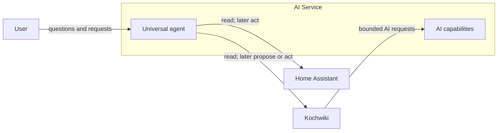

# System Overview

The ecosystem consists of independently useful services connected through explicit APIs. [[AI Service]] provides shared AI capabilities and contains the universal agent; it does not replace the responsibilities of the domain services.

## Projects

- [[Home Assistant]]
- [[Kochwiki]]
- [[AI Service]]

## Intended relationships

- [[Kochwiki]] owns recipes, ingredients, recipe history, and associated media. It may request bounded AI capabilities but remains responsible for validating and persisting results.
- [[Home Assistant]] owns home state, automation, and execution of home-related actions.
- [[AI Service]] owns model access, reusable AI operations, agent orchestration, and its service connectors.
- The universal agent is a capability within the AI Service, not a separate project.

## Shared principles

- Each domain service owns its data, validates changes, and remains useful when the AI Service is unavailable.
- Cross-service access uses explicit APIs rather than direct database or filesystem access.
- AI-generated changes are proposals until the owning service or user accepts them.
- Human sessions and machine-to-machine identities are separate concerns.
- Agent integrations begin read-only. Actions are added deliberately with scoped authorization, validation, and auditability.
- Live or changing information, such as weather, comes from a tool or service rather than model memory.
- Provider-specific AI details remain behind the AI Service boundary.

## Direction of travel

1. Stabilize Kochwiki while establishing the basic AI Service and agent foundation.
2. Add domain prerequisites before their AI features: recipe versioning before optimization, and general image support before image generation.
3. Introduce read-only agent access through constrained service interfaces.
4. Add selected actions only after authentication, authorization, confirmation policy, and auditing are established.

## Open questions

- Which source should provide live weather information?
- Where should users initially interact with the universal agent?
- How should service identities and permissions be managed across the network?
- Which Home Assistant entities and actions should be exposed first?
