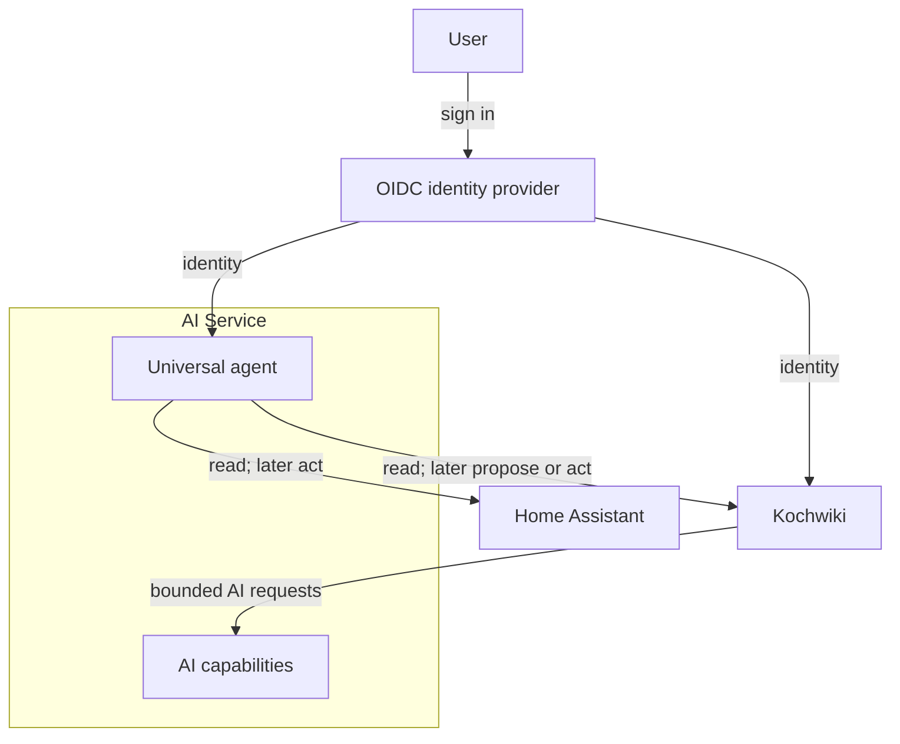

# System Overview

The ecosystem consists of independently useful services connected through explicit APIs. [[AI Service]] provides shared AI capabilities and is intended to contain the universal agent; it does not replace the responsibilities of the domain services.

## Projects

- [[Home Assistant]]
- [[Kochwiki]]
- [[AI Service]]

An external identity provider is shared infrastructure rather than a domain project.

## Current integration

On the Kochwiki v2 and AI Service `staging` branches, Kochwiki starts recipe-scoped conversations through an AI Service gateway and imports the shared Angular chat package. The AI Service produces validated recipe proposal artifacts; Kochwiki renders them and creates a draft only after an explicit user action. Recipe versions and drafts exist in Kochwiki. This integration currently relies on private-network deployment and temporary user selection; the intended OIDC, ownership, delegated authorization, and universal-agent connections below are not yet implemented.

## Intended relationships

```mermaid
flowchart TB
    User[User] -->|sign in| IdP[OIDC identity provider]
    IdP -->|identity| Kochwiki[Kochwiki]
    IdP -->|identity| Agent[Universal agent]

    Kochwiki -->|bounded AI requests| Capabilities[AI capabilities]
    Agent -->|read; later propose or act| Kochwiki
    Agent -->|read; later act| HA[Home Assistant]

    subgraph AIS[AI Service]
        Capabilities
        Agent
    end
```

- [[Kochwiki]] owns recipes, ingredients, recipe history, and associated media. It may request bounded AI capabilities but remains responsible for validating and persisting results.
- [[Home Assistant]] owns home state, automation, and execution of home-related actions.
- [[AI Service]] owns model access, reusable AI operations, agent orchestration, and its service connectors.
- The universal agent is a capability within the AI Service, not a separate project.
- The external identity provider authenticates human users for Kochwiki initially and may later provide SSO across additional applications.

## Shared principles

- Human authentication uses an external provider through OAuth 2.0 and OpenID Connect; see [[DEC-002 External OIDC Provider for Human Authentication]].
- Identity-provider claims establish identity, while each domain service maps that identity locally and owns authorization.
- Each application and API has its own registration or audience boundary.
- Each domain service owns its data, validates changes, and remains useful when the AI Service is unavailable.
- Cross-service access uses explicit APIs rather than direct database or filesystem access.
- AI-generated changes are proposals until the owning service or user accepts them.
- Human sessions and machine-to-machine identities are separate concerns.
- Agent interactions act on behalf of authenticated users and remain bounded by both user permissions and narrower tool permissions.
- Agent integrations begin read-only. Actions are added deliberately with scoped authorization, validation, and auditability.
- Live or changing information, such as weather, comes from a tool or service rather than model memory.
- Provider-specific AI and identity details remain behind stable service boundaries where practical.

## Direction of travel

1. Complete the recipe-chat and version/draft review experience already under development on staging.
2. Implement [[Browser Authentication Foundation]], recipe ownership, and delegated authorization before exposing the integrated AI flow beyond its current private-network boundary.
3. Add general image support before image generation, and complete the universal agent before its project connectors.
4. Introduce read-only agent access through constrained service interfaces.
5. Add selected actions only after authentication, authorization, confirmation policy, and auditing are established; extend shared identity to further applications as they emerge.

## Open questions

- Which identity-provider product should be selected first?
- Should Kochwiki use a PKCE-based SPA or a Backend-for-Frontend session?
- Which source should provide live weather information?
- Where should users initially interact with the universal agent?
- How should service identities and delegated user context be managed across the network?
- Which Home Assistant entities and actions should be exposed first?
